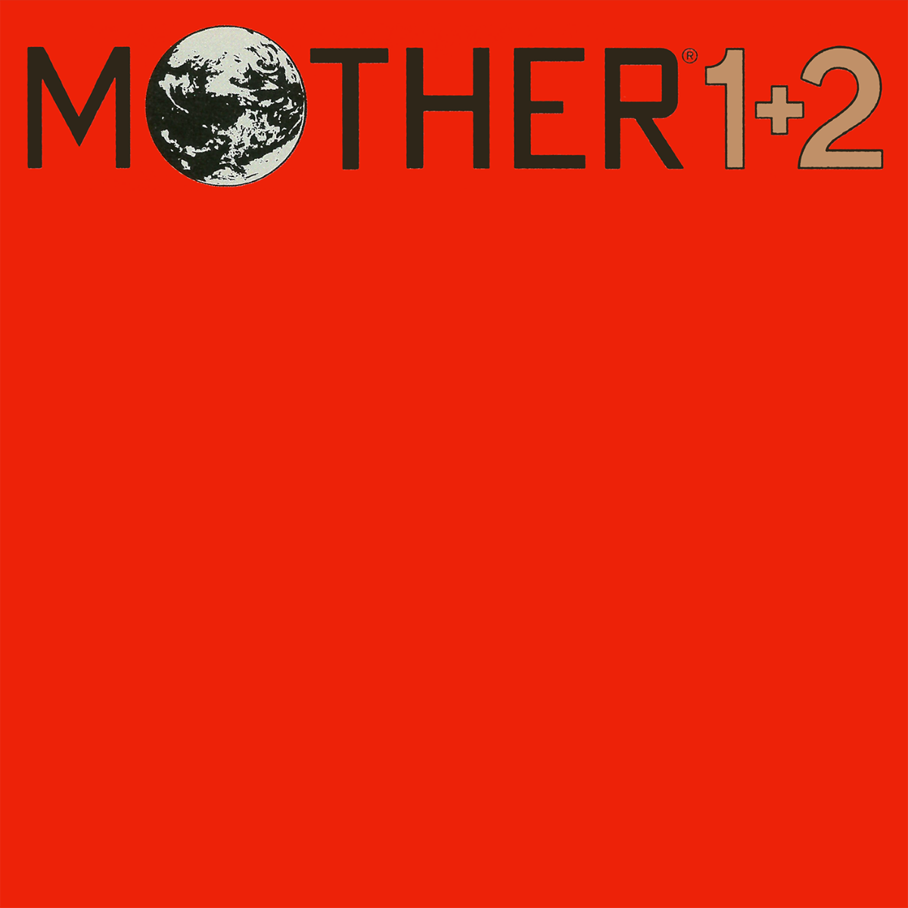

# Nintendo Mother 1 + 2 OST

- [Mother 1 + 2 OST](https://honux77.github.io/earthbound0-ost)
- [GitHub](https://github.com/honux77/earthbound0-ost)

패미컴과 슈퍼패미컴으로 각각 출시된 Mother 1, Mother 2 (영문판 Earthbound)의 OST 페이지입니다.



## 기능

- OST 재생
- 음향 시각화 (이퀄라이저)
- 1920 \* 1080 화면에서 가장 정상적으로 표시됩니다.
- 모바일 반응형 (잘 안 됨)

## 왜 만들었나

[인프런 진유림님 리액트 입문 강의](https://www.inflearn.com/course/%EB%A7%8C%EB%93%A4%EB%A9%B4%EC%84%9C-%EB%B0%B0%EC%9A%B0%EB%8A%94-%EB%A6%AC%EC%95%A1%ED%8A%B8-%EA%B8%B0%EC%B4%88)를 듣다가 갑자기 토이프로젝트가 하고 싶어져서 만들게 되었습니다.

## 알려진 문제점

- 사파리 브라우저에서는 음악이 재생되지 않습니다.
- 네크워크 상태에 따라 로딩이 발생할 수 있습니다.
- 기기의 해상도에 따라 인터페이스의 배치가 깨질 수 있습니다.

## How to build and deploy to gh-pages

package.json의 homepage 값을 알맞게 수정합니다.

```bash
# npm run build
# npm deploy
```
