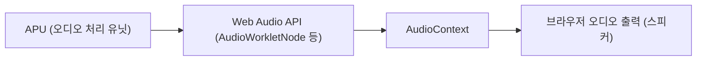

# Nintendo Famicom Mother 1 OST

- [Mother 1 OST](https://earthbound0.vercel.app/)

## 기능

- OST 재생
- 음향 시각화
- 1920 \* 1080 화면에서 가장 정상적으로 표시됩니다.
- 모바일 반응형 (잘 안 됨)

## 왜 만들었나

[인프런 진유림님 리액트 입문 강의](https://www.inflearn.com/course/%EB%A7%8C%EB%93%A4%EB%A9%B4%EC%84%9C-%EB%B0%B0%EC%9A%B0%EB%8A%94-%EB%A6%AC%EC%95%A1%ED%8A%B8-%EA%B8%B0%EC%B4%88)를 듣다가 갑자기 토이프로젝트가 하고 싶어져서 만들게 되었습니다.

## 작동 방식

### APU에서 브라우저 오디오 출력까지

## 알려진 문제점

- 1번 트랙의 2번 펄스가 살짝 깨집니다. (JSNES의 문제로 보임)

## Vercel로 배포하기

1. [Vercel](https://vercel.com/)에 가입 후, GitHub 저장소를 연결합니다.
2. 프로젝트를 import하면 자동으로 배포가 진행됩니다.
3. 배포가 완료되면 제공되는 URL로 접속할 수 있습니다.

